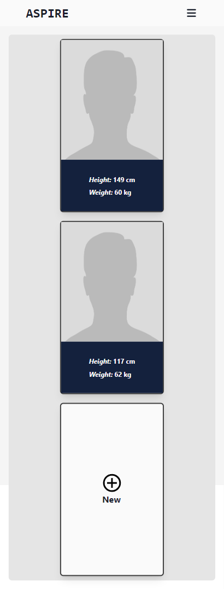
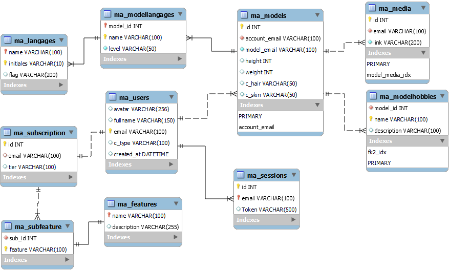

# Aspire

## Project Overview

#### Description :

Aspire is a model agency app. It provides a platform for models to create profiles and display their portfolios, while clients can easily browse and connect with them for their projects.

#### User story (In progress):
- [x] As a user, I want to be able to create and edit my user profile, which will serve as the administrator profile for all other model profiles.
  [x] As a user, I want to be able to create an account using my Facebook, Google, or Apple credentials.
  - [x] Google
  - [ ] Facebook
  - [ ] Apple

- [x] As a user, I want to be able to create and edit my model profile, which will be used for castings and showcasing my portfolio.
- [ ] As a user, I want to visit the subscription page to choose the desired subscription plan (Basic or Pro) for a duration of one year.
- [ ] As a user, I want to have a payment page where I can securely complete the checkout process and place an order for the selected subscription plan.

## Technologies

#### Front

#### Back

 
 

 

## Getting Started

### Steps

To test the current version of Aspire :
 <ol>
    <li>Visit the Aspire website: https://liolle.github.io/Aspire </li>
    <li>Login with you google account  </li>
    <li>Explore the different features and functionalities </li>
    <li>Provide any feedback or bug reports by submitting an issue on the project's GitHub repository </li>
 </ol> 
 
 ### Demo 

   

    
     
   

   

#### ERD :

    

## Documentation

--- Incoming ---
